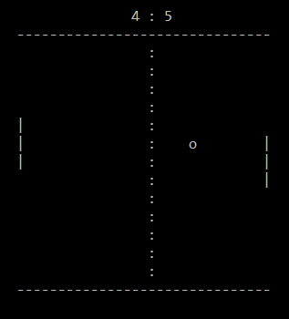

# Text Pong

Text-based Pong Game, with special movement button.

This game can be played against AI or against another player.
The moves are UP, DOWN to move the bar and SPECIAL to perform the special move. When rebound using the special move, the ball goes twice as fast. To use the special movement you have to be with the bar next to the ball and press S.
The AI goes from level 1 to level 5. At level 5 it follow all the balls and rebounds it, and it is almost impossible to beat it (just with lucky special moves).

## Skills

- C language
- Basic Artificial Intellingence
